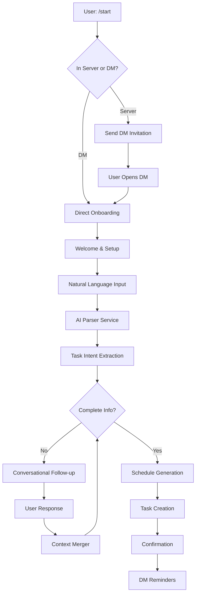

# DM-Based Natural Language Task Creation - Architecture Plan

## 🎯 Overview

Enhanced architecture for a DM-first Discord task bot that uses natural language processing for conversational task creation. Users interact primarily through private messages after initial setup, with intelligent scheduling and personalized reminders.

## 🏗️ System Architecture

### Core Design Principles

1. **DM-First Interaction**: All conversations happen in private messages
2. **Natural Language Processing**: AI-powered understanding of task requests
3. **Conversational Flow**: Multi-turn conversations for task creation
4. **Intelligent Scheduling**: Automatic schedule generation from patterns
5. **Private Reminders**: All notifications sent as DMs

### Architecture Diagram



## 🔧 Technical Implementation

### 1. Enhanced Bot Structure

```python
# src/bot.py - Enhanced for DM-first interactions
class TaskReminderBot(commands.Bot):
    def __init__(self, config: Config, db_manager: DatabaseManager):
        # Enable DM intents
        intents = discord.Intents.default()
        intents.message_content = True
        intents.dm_messages = True
        intents.dm_reactions = True

        super().__init__(
            command_prefix=config.command_prefix,
            intents=intents,
            help_command=None,
            case_insensitive=True,
        )

    async def on_message(self, message):
        """Handle DM conversations"""
        if message.author.bot:
            return

        # Check if it's a DM
        if isinstance(message.channel, discord.DMChannel):
            await self.handle_dm_conversation(message)
        else:
            await self.process_commands(message)

    async def handle_dm_conversation(self, message):
        """Process natural language in DMs"""
        conversation_manager = self.get_conversation_manager()
        await conversation_manager.handle_dm_message(message)
```

### 2. DM Conversation Manager

```python
# src/services/dm_conversation_manager.py
from enum import Enum
from dataclasses import dataclass
from typing import Optional, Dict, Any, List
import discord

class ConversationState(Enum):
    ONBOARDING = "onboarding"
    IDLE = "idle"
    TASK_CREATION = "task_creation"
    TIME_COLLECTION = "time_collection"
    CONFIRMATION = "confirmation"
    TASK_MANAGEMENT = "task_management"

@dataclass
class UserConversation:
    user_id: int
    state: ConversationState
    context: Dict[str, Any]
    last_interaction: datetime
    pending_tasks: Optional[List[Dict]]

class DMConversationManager:
    """Manages DM-based conversations for task creation"""

    def __init__(self, bot, db_manager, ai_handler):
        self.bot = bot
        self.db_manager = db_manager
        self.ai_handler = ai_handler
        self.active_conversations: Dict[int, UserConversation] = {}

    async def handle_dm_message(self, message: discord.Message):
        """Process incoming DM messages"""
        user_id = message.author.id
        content = message.content.strip()

        # Get or create conversation state
        conversation = await self.get_conversation(user_id)

        # Route based on current state
        if conversation.state == ConversationState.ONBOARDING:
            await self.handle_onboarding(message, conversation)
        elif conversation.state == ConversationState.IDLE:
            await self.handle_idle_input(message, conversation)
        elif conversation.state == ConversationState.TASK_CREATION:
            await self.handle_task_creation(message, conversation)
        elif conversation.state == ConversationState.TIME_COLLECTION:
            await self.handle_time_collection(message, conversation)
        elif conversation.state == ConversationState.CONFIRMATION:
            await self.handle_confirmation(message, conversation)

    async def handle_idle_input(self, message: discord.Message, conversation: UserConversation):
        """Handle natural language task creation requests"""
        content = message.content

        # Check if it's a task creation request
        if await self.is_task_creation_request(content):
            # Parse the natural language input
            parsed_intent = await self.ai_handler.parse_task_intent(content)

            if parsed_intent.confidence > 0.7:
                conversation.context['parsed_intent'] = parsed_intent
                conversation.state = ConversationState.TASK_CREATION

                # Check what information is missing
                missing_info = parsed_intent.missing_info

                if 'time' in missing_info:
                    await self.ask_for_time(message.channel, parsed_intent)
                    conversation.state = ConversationState.TIME_COLLECTION
                else:
                    await self.generate_and_confirm_tasks(message.channel, conversation)
            else:
                await self.send_clarification_request(message.channel, content)
        else:
            # Handle other types of requests (list tasks, help, etc.)
            await self.handle_general_request(message, conversation)
```

### 3. Natural Language Parser Enhancement

```python
# src/services/natural_language_parser.py
from dataclasses import dataclass
from typing import List, Optional, Dict, Any
from datetime import time, datetime
import re

@dataclass
class TaskIntent:
    task_name: str
    frequency_type: str  # daily, weekly, specific_days, interval
    frequency_value: Any  # number or list of days
    time_preference: Optional[str]
    description: Optional[str]
    confidence: float
    missing_info: List[str]

class NaturalLanguageParser:
    """Enhanced parser for DM-based natural language task creation"""

    def __init__(self, ai_handler):
        self.ai_handler = ai_handler
        self.time_patterns = {
            'morning': time(8, 0),
            'afternoon': time(14, 0),
            'evening': time(18, 0),
            'night': time(21, 0),
            'before work': time(7, 0),
            'after work': time(17, 30),
            'before bed': time(21, 30),
        }

        self.frequency_patterns = {
            r'daily|every day': ('daily', 1),
            r'(\d+)\s*times?\s*(?:a|per)\s*week': ('weekly_count', None),
            r'every\s*other\s*day': ('interval', 2),
            r'weekdays?(?:\s*only)?': ('weekdays', ['monday', 'tuesday', 'wednesday', 'thursday', 'friday']),
            r'weekends?(?:\s*only)?': ('weekends', ['saturday', 'sunday']),
            r'(?:every\s*)?(?:mon|tues|wed|thurs|fri|sat|sun)': ('specific_days', None),
        }

    async def parse_task_intent(self, user_input: str) -> TaskIntent:
        """Parse natural language input into structured task intent"""

        # Use AI for complex parsing
        ai_result = await self.ai_handler.parse_with_ai(user_input)

        # Combine with rule-based parsing for reliability
        rule_result = self.parse_with_rules(user_input)

        # Merge results with AI taking precedence but rules as fallback
        return self.merge_parsing_results(ai_result, rule_result, user_input)

    def parse_with_rules(self, text: str) -> Dict[str, Any]:
        """Rule-based parsing as fallback"""
        text_lower = text.lower()

        # Extract task name (simple heuristic)
        task_name = self.extract_task_name(text_lower)

        # Extract frequency
        frequency_type, frequency_value = self.extract_frequency(text_lower)

        # Extract time
        time_preference = self.extract_time_preference(text_lower)

        return {
            'task_name': task_name,
            'frequency_type': frequency_type,
            'frequency_value': frequency_value,
            'time_preference': time_preference,
            'confidence': 0.6,  # Rule-based confidence
        }

    def extract_frequency(self, text: str) -> tuple:
        """Extract frequency pattern from text"""
        for pattern, (freq_type, freq_value) in self.frequency_patterns.items():
            match = re.search(pattern, text)
            if match:
                if freq_type == 'weekly_count':
                    return ('weekly_count', int(match.group(1)))
                return (freq_type, freq_value)

        return ('daily', 1)  # Default
```

### 4. Enhanced Reminder System for DMs

```python
# src/services/dm_reminder_service.py
class DMReminderService:
    """Handles sending reminders via DMs"""

    def __init__(self, bot, db_manager, ai_handler):
        self.bot = bot
        self.db_manager = db_manager
        self.ai_handler = ai_handler

    async def send_task_reminder(self, user_id: int, task: Task):
        """Send personalized reminder via DM"""
        try:
            user = await self.bot.fetch_user(user_id)

            # Get user's streak info for context
            streak_info = await self.get_user_streak_context(user_id, task.id)

            # Generate personalized reminder message
            reminder_message = await self.ai_handler.generate_reminder_message(
                task=task,
                streak_context=streak_info,
                user_id=user_id
            )

            # Create reminder embed
            embed = discord.Embed(
                title=f"⏰ Time for: {task.name}",
                description=reminder_message,
                color=0x3498DB,
                timestamp=datetime.utcnow()
            )

            if task.description:
                embed.add_field(
                    name="📝 Details",
                    value=task.description,
                    inline=False
                )

            embed.add_field(
                name="🎯 Quick Actions",
                value="Reply with a photo when you complete this task!",
                inline=False
            )

            # Add streak motivation
            if streak_info['current_streak'] > 0:
                embed.add_field(
                    name="🔥 Current Streak",
                    value=f"{streak_info['current_streak']} days",
                    inline=True
                )

            await user.send(embed=embed)

        except discord.Forbidden:
            # User has DMs disabled - log and handle gracefully
            await self.handle_dm_disabled(user_id, task)
        except Exception as e:
            logger.error(f"Failed to send DM reminder to {user_id}: {e}")
```

### 5. Enhanced Task Creation Flow

```python
# Example conversation flow
class TaskCreationFlow:
    """Manages the complete task creation conversation"""

    async def start_task_creation(self, channel, user_input: str):
        """Begin task creation from natural language"""

        # Parse initial input
        intent = await self.parser.parse_task_intent(user_input)

        if intent.confidence > 0.8:
            # High confidence - proceed with creation
            if not intent.missing_info:
                await self.create_tasks_immediately(channel, intent)
            else:
                await self.collect_missing_info(channel, intent)
        else:
            # Low confidence - ask for clarification
            await self.ask_for_clarification(channel, user_input)

    async def collect_missing_info(self, channel, intent: TaskIntent):
        """Collect missing information conversationally"""

        if 'time' in intent.missing_info:
            response = await self.ai_handler.generate_time_question(intent)
            await channel.send(response)
        elif 'frequency' in intent.missing_info:
            response = await self.ai_handler.generate_frequency_question(intent)
            await channel.send(response)

    async def create_tasks_immediately(self, channel, intent: TaskIntent):
        """Create tasks and show confirmation"""

        # Generate schedule
        schedule = await self.schedule_generator.generate_schedule(intent)

        # Create preview
        preview = self.create_task_preview(intent, schedule)

        # Send confirmation
        embed = discord.Embed(
            title="✅ Ready to create your tasks!",
            description=preview,
            color=0x00FF00
        )

        embed.add_field(
            name="🤔 Does this look good?",
            value="Reply with 'yes' to create these tasks, or 'no' to modify them.",
            inline=False
        )

        await channel.send(embed=embed)
```

## 🎯 User Experience Flow

### Onboarding Flow

```
User: /start (in server or DM)

Bot: "Hey! 👋 I'm your personal task reminder bot.
     I'll help you stay on track with your daily goals through private messages.

     Just tell me what you want to work on in natural language!

     Examples:
     • 'I want to work out 3 times a week'
     • 'Remind me to read every weekday morning'
     • 'I need to meditate daily at 7 PM'

     What would you like to start with?"
```

### Task Creation Examples

```
User: "I want to work out 3 times a week"

Bot: "Nice! 💪 Working out 3 times a week is a solid goal.
     What time works best for your workouts?
     (e.g., '7:00 AM', 'morning', 'after work')"

User: "7:00 AM"

Bot: "Perfect! Here's what I'll set up for you:

     🏋️ Workout Schedule:
     • Monday at 7:00 AM
     • Wednesday at 7:00 AM
     • Friday at 7:00 AM

     I'll send you reminders here in our DMs each day.
     Does this schedule work for you? (yes/no)"

User: "yes"

Bot: "Awesome! 🎉 Your workout reminders are all set up.
     I'll send you your first reminder tomorrow at 7:00 AM.

     You can always say 'show my tasks' to see everything,
     or just tell me about new habits you want to build!"
```

## 🔧 Implementation Considerations

### DM Permissions & Handling

```python
async def ensure_dm_access(self, user_id: int) -> bool:
    """Ensure bot can send DMs to user"""
    try:
        user = await self.bot.fetch_user(user_id)
        # Test DM access
        await user.send("Testing DM access...")
        return True
    except discord.Forbidden:
        return False
    except Exception:
        return False

async def handle_dm_disabled(self, user_id: int):
    """Handle when user has DMs disabled"""
    # Could fall back to server mentions or disable reminders
    # Log the issue and potentially notify in server
    pass
```

### Conversation State Persistence

```python
# Database schema for conversation state
CREATE TABLE dm_conversations (
    user_id BIGINT PRIMARY KEY,
    state VARCHAR(50) NOT NULL,
    context JSONB NOT NULL,
    last_interaction TIMESTAMP DEFAULT NOW(),
    expires_at TIMESTAMP
);
```

### Privacy & Security

- All conversations happen in private DMs
- Conversation state expires after inactivity
- No sensitive data stored in conversation context
- User can clear their data anytime

## 🚀 Benefits of DM-First Design

1. **Privacy**: All interactions are private
2. **Personalization**: Tailored conversations without server noise
3. **Convenience**: No need to switch channels or remember commands
4. **Natural**: Feels like chatting with a personal assistant
5. **Focus**: Dedicated space for task management

This architecture transforms the bot from a server-based tool into a personal assistant that users interact with naturally through private conversations.
