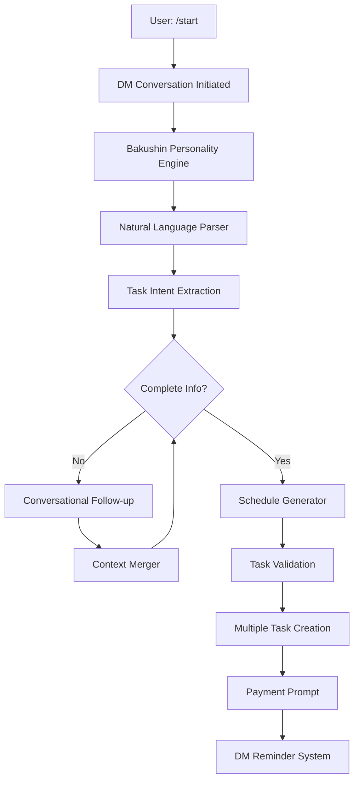

# Bakushin AI - Natural Language Task Creation Complete Specification

## 🎯 Project Overview

This document provides the complete specification for implementing natural language task creation in Bakushin AI, a Discord bot with a casual 20-something horse personality that helps users build habits through DM-based conversations and accountability.

## 🏗️ System Architecture Summary

### Core Components



### Key Features

1. **DM-First Interaction**: All conversations happen in private messages
2. **Natural Language Processing**: AI-powered understanding of casual task requests
3. **Conversational Flow**: Multi-turn conversations that feel like texting a friend
4. **Intelligent Scheduling**: Automatic schedule generation from patterns
5. **Bakushin Personality**: Casual 20-something horse with motivational energy
6. **Payment Integration**: Natural payment prompt after first task creation

## 🗣️ Bakushin Personality Specification

### Core Identity

- **Age**: 20-something AI horse
- **Personality**: Casual, slightly sarcastic, motivational, supportive
- **Communication Style**: Modern slang, lowercase, emoji usage, direct but friendly
- **Horse References**: Subtle, natural integration (~15% of messages)

### Example Personality Expressions

```
Greetings: "yooo", "hey 🤨", "wassup"
Motivation: "lock in", "lets gooo", "built different", "horsepower energy"
Reality Check: "bruh", "cap 🧢", "be fr", "stop the cap"
Horse References: "gallop towards your goals", "no horsing around", "stallion energy"
```

## 💬 Conversation Flow Specification

### 1. Initial Contact (/start command)

```
User: /start

Bakushin: "yooo still showing up even after traveling!
         hey 🤨

         another person that wants bakushin to help them "lock in" huh?

         whats ur name?"
```

### 2. Name Collection & Goal Setting

```
User: "John"

Bakushin: "john... hmm ok not the most creative but we'll work with it

         the fact ur here tho means ur better than the 98% of other people
         doomscrolling their dreams away on tiktok rn!

         so tell me ur goals, where do you want to be in 3 months?
         it could be related to fitness, money, content, etc.

         Or were you mostly just looking for someone to yap to LOL"
```

### 3. Natural Language Task Creation

```
User: "I want to work out 3 times a week"

Bakushin: "ayy fitness arc lets gooo 💪

         ok but like be more specific tho... "get in shape" is what
         everyone says on january 1st before they quit by february

         how many times a week you thinking? daily? 3x?
         and what time works for you?"

User: "3 times a week in the morning"

Bakushin: "ok ok i see you with the morning grind
         respect for not being one of those "ill work out later" people

         so 3x a week mornings... im thinking monday wednesday friday?
         that way you get rest days but stay consistent

         what time we talking? like 7am or are you more of a 6am psychopath? 😂"
```

### 4. Schedule Confirmation & Payment

```
User: "7am works"

Bakushin: "bet! so here's what im setting up for you:

         🏋️ Workout Schedule:
         • Monday 7:00 AM
         • Wednesday 7:00 AM
         • Friday 7:00 AM

         ill hit you up each morning to make sure you actually show up
         and not just snooze your way to failure like most people lol

         this look good? (yes/no)"

User: "yes"

Bakushin: "LETS GOOOO 🔥

         alright john your workout reminders are locked and loaded
         time to gallop towards those gains

         but real talk... this is where most people would just ghost me
         so to make sure you're actually serious about this...

         its gonna be $5/month to keep me as your accountability partner

         think of it as less than a starbucks coffee but way better for your gains

         you down? 💳"
```

## 🧠 Natural Language Processing Specification

### Supported Patterns

#### Frequency Patterns

```python
SUPPORTED_PATTERNS = {
    # Daily
    'daily': ['daily', 'every day', 'each day'],

    # Weekly Count
    'weekly_count': [
        'X times a week', 'X times per week', 'once a week',
        'twice a week', 'three times weekly'
    ],

    # Specific Days
    'specific_days': [
        'weekdays', 'weekends', 'monday and wednesday',
        'every tuesday', 'weekdays only'
    ],

    # Intervals
    'intervals': [
        'every other day', 'every two days', 'every three days'
    ],

    # Bi-weekly
    'bi_weekly': [
        'every two weeks', 'bi-weekly', 'twice a month'
    ]
}
```

#### Time Expressions

```python
TIME_EXPRESSIONS = {
    # Relative Times
    'morning': '08:00',
    'early morning': '06:00',
    'afternoon': '14:00',
    'evening': '18:00',
    'before work': '07:00',
    'after work': '17:30',
    'before bed': '21:30',

    # Exact Times
    '7:30 AM': '07:30',
    '2:15 PM': '14:15',
    '18:00': '18:00'
}
```

### Parsing Confidence Levels

- **High Confidence (0.8+)**: Proceed with task creation
- **Medium Confidence (0.5-0.8)**: Ask clarifying questions
- **Low Confidence (<0.5)**: Request more specific information

## 🔧 Technical Implementation Requirements

### Database Schema Extensions

```sql
-- Conversation state management
CREATE TABLE dm_conversations (
    user_id BIGINT PRIMARY KEY,
    state VARCHAR(50) NOT NULL,
    context JSONB NOT NULL,
    last_interaction TIMESTAMP DEFAULT NOW(),
    expires_at TIMESTAMP
);

-- Enhanced task model
ALTER TABLE tasks ADD COLUMN generation_method VARCHAR(50) DEFAULT 'manual';
ALTER TABLE tasks ADD COLUMN parent_request_id UUID;
ALTER TABLE tasks ADD COLUMN scheduling_pattern JSONB;

-- Payment tracking
CREATE TABLE payment_prompts (
    user_id BIGINT PRIMARY KEY,
    prompted_at TIMESTAMP DEFAULT NOW(),
    responded BOOLEAN DEFAULT FALSE,
    response_type VARCHAR(20)
);
```

### Required Services

#### 1. DM Conversation Manager

```python
# src/services/dm_conversation_manager.py
class DMConversationManager:
    async def handle_dm_message(self, message: discord.Message)
    async def get_conversation(self, user_id: int) -> UserConversation
    async def update_conversation_state(self, user_id: int, new_state: ConversationState)
    async def handle_onboarding(self, message: discord.Message, conversation: UserConversation)
    async def handle_task_creation(self, message: discord.Message, conversation: UserConversation)
```

#### 2. Natural Language Parser

```python
# src/services/natural_language_parser.py
class NaturalLanguageParser:
    async def parse_task_intent(self, user_input: str) -> TaskIntent
    async def extract_scheduling_pattern(self, text: str) -> SchedulingPattern
    async def parse_time_expression(self, time_text: str) -> TimeInfo
    def parse_with_rules(self, text: str) -> Dict[str, Any]
```

#### 3. Bakushin Personality Engine

```python
# src/services/bakushin_personality.py
class BakushinPersonality:
    def generate_response(self, context: Dict[str, Any], tone: ConversationTone) -> str
    def add_personality_to_reminder(self, task_name: str, streak_count: int) -> str
    def should_use_horse_reference(self) -> bool
    def get_horse_reference(self, category: str) -> str
```

#### 4. Advanced Scheduling Engine

```python
# src/services/scheduling_engine.py
class AdvancedSchedulingEngine:
    async def generate_schedule(self, pattern: SchedulePattern, task_name: str) -> List[GeneratedTask]
    def _generate_weekly_count_schedule(self, pattern: SchedulePattern) -> List[GeneratedTask]
    def _generate_specific_days_schedule(self, pattern: SchedulePattern) -> List[GeneratedTask]
    def optimize_schedule_for_user_preferences(self, tasks: List[GeneratedTask]) -> List[GeneratedTask]
```

#### 5. Enhanced Reminder Service

```python
# src/services/dm_reminder_service.py
class DMReminderService:
    async def send_task_reminder(self, user_id: int, task: Task)
    async def generate_personalized_reminder(self, task: Task, streak_info: Dict) -> str
    async def handle_dm_disabled(self, user_id: int, task: Task)
```

### Bot Integration Requirements

#### Enhanced Bot Class

```python
# src/bot.py modifications
class TaskReminderBot(commands.Bot):
    def __init__(self, config: Config, db_manager: DatabaseManager):
        # Enable DM intents
        intents = discord.Intents.default()
        intents.message_content = True
        intents.dm_messages = True
        intents.dm_reactions = True

    async def on_message(self, message):
        """Handle DM conversations"""
        if isinstance(message.channel, discord.DMChannel):
            await self.handle_dm_conversation(message)
        else:
            await self.process_commands(message)
```

#### Enhanced Commands

```python
# src/commands/user_commands.py
@app_commands.command(name="start", description="Start your journey with Bakushin")
async def start_command(self, interaction: discord.Interaction):
    """Initialize DM conversation with user"""
    # Check if user can receive DMs
    # Send initial DM or guide to enable DMs
    # Set up conversation state
```

## 🎯 User Experience Specifications

### Conversation States

1. **Onboarding**: Name collection and goal setting
2. **Idle**: Waiting for user input or commands
3. **Task Creation**: Active task creation conversation
4. **Time Collection**: Collecting missing time information
5. **Confirmation**: Confirming generated schedule
6. **Payment Prompt**: Handling payment discussion

### Error Handling Requirements

- **AI Service Failure**: Fallback to rule-based parsing
- **DM Permissions Denied**: Guide user to enable DMs
- **Invalid Input**: Ask clarifying questions with examples
- **Parsing Failures**: Request more specific information

### Performance Requirements

- **Response Time**: < 2 seconds for natural language parsing
- **Conversation State**: < 500ms for state operations
- **Memory Usage**: < 100MB for 1000 concurrent conversations
- **Horse References**: 10-20% frequency in motivational messages

## 🧪 Testing Requirements

### Test Categories

1. **Natural Language Parsing**: Pattern recognition accuracy
2. **Conversation Flows**: Multi-turn conversation handling
3. **Personality Consistency**: Bakushin voice maintenance
4. **Integration Tests**: End-to-end user journeys
5. **Error Recovery**: Graceful failure handling

### Success Criteria

- ✅ 90%+ accuracy on common natural language patterns
- ✅ Consistent personality across all interactions
- ✅ Smooth conversation state transitions
- ✅ Natural payment prompt integration
- ✅ Reliable DM reminder delivery

## 🚀 Implementation Phases

### Phase 1: Core DM System (Week 1)

- DM conversation manager
- Basic personality responses
- Conversation state management

### Phase 2: Natural Language Processing (Week 2)

- AI-powered parsing
- Rule-based fallbacks
- Pattern recognition

### Phase 3: Advanced Features (Week 3)

- Complex scheduling patterns
- Payment prompt integration
- Error handling

### Phase 4: Polish & Testing (Week 4)

- Comprehensive testing
- Performance optimization
- Documentation completion

## 📋 Deliverables

1. **[DM_BASED_ARCHITECTURE.md](DM_BASED_ARCHITECTURE.md)** - Complete system architecture
2. **[BAKUSHIN_PERSONALITY_DESIGN.md](BAKUSHIN_PERSONALITY_DESIGN.md)** - Personality specification
3. **[SCHEDULING_ENGINE_DESIGN.md](SCHEDULING_ENGINE_DESIGN.md)** - Advanced scheduling logic
4. **[TESTING_STRATEGY.md](TESTING_STRATEGY.md)** - Comprehensive testing plan
5. **[NATURAL_LANGUAGE_TASK_CREATION_SPEC.md](NATURAL_LANGUAGE_TASK_CREATION_SPEC.md)** - This complete specification

This specification provides everything needed to implement Bakushin's natural language task creation system, transforming the bot from a command-based tool into a conversational accountability partner that feels like chatting with a supportive friend who happens to be a horse.

## 🎉 Expected Outcomes

### User Experience

- **Natural Conversations**: Users interact through casual DMs
- **Intelligent Parsing**: Complex scheduling requests understood automatically
- **Engaging Personality**: Bakushin feels like a real friend, not a bot
- **Seamless Payment**: Natural transition to paid accountability

### Technical Benefits

- **Scalable Architecture**: Handles thousands of concurrent conversations
- **Reliable Parsing**: AI + rule-based hybrid approach
- **Maintainable Code**: Clean separation of concerns
- **Comprehensive Testing**: High confidence in system reliability

The result is a unique Discord bot that combines advanced natural language processing with an engaging personality to create a truly differentiated user experience in the habit-building space.
